# Documentation TagUI pour Dagda-Lite

## 📋 Vue d'ensemble

Cette documentation présente l'intégration de **TagUI** comme solution RPA (Robotic Process Automation) dans l'écosystème **dagda-lite**. TagUI s'intègre parfaitement dans l'architecture ultra-légère de dagda-lite en tant que composant du module **fianna**.

### Pourquoi TagUI ?

- **Ultra-léger** : ~50MB vs Robot Framework (~500MB)
- **Scriptable** : Compatible avec la philosophie code-first
- **Conteneurisable** : Excellent support Docker/Podman
- **Intégration naturelle** : Communication API avec N8N

## 🏗️ Architecture

### Structure des répertoires

```
cauldron/fianna/
├── n8n/                 # Workflows visuels (existant)
├── tagui/              # 🆕 Module RPA TagUI
│   ├── manage.sh       # Script de gestion
│   ├── pod.yml         # Configuration Podman
│   ├── server.py       # API REST TagUI
│   ├── scripts/        # Scripts RPA
│   │   ├── web_scraping.tag
│   │   ├── data_entry.tag
│   │   └── process_order.tag
│   └── config/         # Configuration
└── adminer/            # Administration DB (existant)
```

### Workflow d'intégration

```mermaid
graph LR
    A[N8N Workflow] --> B[TagUI API]
    B --> C[Script TagUI]
    C --> D[Automatisation]
    D --> E[Résultats]
    E --> A
```



## 📦 Configuration Pod

### pod.yml

```yaml
apiVersion: v1
kind: Pod
metadata:
  name: tagui
  labels:
    app: dagda-lite
    component: tagui
    category: fianna
spec:
  containers:
  - name: tagui
    image: tagui/tagui:latest
    ports:
    - containerPort: ${TAGUI_PORT}
      hostPort: ${TAGUI_PORT}
    volumes:
    - ${DAGDA_ROOT}/cauldron/fianna/tagui:/app:Z
    - ${DAGDA_ROOT}/.env:/app/.env:ro,Z
    - tagui-scripts:/app/scripts:Z
    workingDir: /app
    environment:
    - TAGUI_PORT=${TAGUI_PORT}
    - DISPLAY=:99
    - XVFB_ARGS=-screen 0 1920x1080x24
    restart: unless-stopped
    resources:
      requests:
        memory: "256Mi"
        cpu: "0.5"
      limits:
        memory: "1Gi"
        cpu: "1"
```

## 🚀 API REST Service

### server.py

```python
import os
import subprocess
from fastapi import FastAPI, HTTPException
from pydantic import BaseModel
import uvicorn
import logging

# Configuration logging
logging.basicConfig(level=logging.INFO)
logger = logging.getLogger(__name__)

app = FastAPI(
    title="TagUI RPA Service",
    description="Service RPA pour dagda-lite",
    version="1.0.0"
)

class RPARequest(BaseModel):
    script_name: str
    parameters: dict = {}
    wait_completion: bool = True

class TagUIService:
    def __init__(self):
        self.scripts_dir = "/app/scripts"
        self.tagui_path = "/usr/local/bin/tagui"
        self.results_dir = "/app/results"
        
        # Créer les répertoires nécessaires
        os.makedirs(self.results_dir, exist_ok=True)
    
    async def execute_script(self, request: RPARequest):
        """Exécuter un script TagUI avec gestion d'erreurs complète"""
        script_path = f"{self.scripts_dir}/{request.script_name}.tag"
        
        if not os.path.exists(script_path):
            raise HTTPException(404, f"Script {request.script_name} non trouvé")
        
        try:
            logger.info(f"Exécution script: {request.script_name}")
            
            # Préparer environnement
            env = os.environ.copy()
            for key, value in request.parameters.items():
                env[f"TAGUI_{key.upper()}"] = str(value)
            
            # Exécuter TagUI
            result = subprocess.run(
                [self.tagui_path, script_path, "-headless"],
                env=env,
                capture_output=True,
                text=True,
                timeout=300,
                cwd=self.results_dir
            )
            
            response = {
                "success": result.returncode == 0,
                "output": result.stdout,
                "error": result.stderr,
                "script": request.script_name,
                "exit_code": result.returncode
            }
            
            logger.info(f"Script {request.script_name} terminé - Code: {result.returncode}")
            return response
            
        except subprocess.TimeoutExpired:
            logger.error(f"Timeout script: {request.script_name}")
            raise HTTPException(408, "Script timeout après 5 minutes")
        except Exception as e:
            logger.error(f"Erreur script {request.script_name}: {str(e)}")
            raise HTTPException(500, f"Erreur d'exécution: {str(e)}")

tagui_service = TagUIService()

@app.get("/")
async def root():
    """Page d'accueil du service"""
    return {
        "service": "TagUI RPA Service",
        "version": "1.0.0",
        "status": "active"
    }

@app.get("/health")
async def health():
    """Endpoint de santé"""
    return {"status": "healthy", "service": "tagui-rpa"}

@app.post("/execute")
async def execute_rpa(request: RPARequest):
    """Endpoint principal d'exécution RPA"""
    return await tagui_service.execute_script(request)

@app.get("/scripts")
async def list_scripts():
    """Lister les scripts RPA disponibles"""
    scripts_dir = "/app/scripts"
    scripts = []
    
    if os.path.exists(scripts_dir):
        for file in os.listdir(scripts_dir):
            if file.endswith('.tag'):
                script_info = {
                    "name": file[:-4],
                    "file": file,
                    "path": f"{scripts_dir}/{file}"
                }
                scripts.append(script_info)
    
    return {"scripts": scripts, "count": len(scripts)}

@app.get("/scripts/{script_name}")
async def get_script_info(script_name: str):
    """Obtenir les informations d'un script spécifique"""
    script_path = f"/app/scripts/{script_name}.tag"
    
    if not os.path.exists(script_path):
        raise HTTPException(404, f"Script {script_name} non trouvé")
    
    with open(script_path, 'r') as f:
        content = f.read()
    
    return {
        "name": script_name,
        "path": script_path,
        "content": content,
        "lines": len(content.split('\n'))
    }

if __name__ == "__main__":
    port = int(os.getenv("TAGUI_PORT", "8970"))
    uvicorn.run(app, host="0.0.0.0", port=port)
```

## 📝 Scripts TagUI

### Exemple 1: Web Scraping (scripts/web_scraping.tag)

```tagui
// Script RPA : Web Scraping automatique
// Utilisation: Extraire des données depuis un site web

// Navigation vers le site
https://`TAGUI_URL`
wait 3 seconds

// Authentification si nécessaire
if present('input[name="username"]')
    type input[name="username"] as `TAGUI_USERNAME`
    type input[name="password"] as `TAGUI_PASSWORD` 
    click button[type="submit"]
    wait 5 seconds

// Attendre le chargement complet
wait for table.data-table

// Extraction des données
read table.data-table to data.csv
echo `Données extraites : $(wc -l < data.csv) lignes`

// Sauvegarde avec timestamp
js timestamp = new Date().toISOString().replace(/[:.]/g, '-')
js filename = 'scraping_' + timestamp + '.csv'
rename data.csv to `filename`

echo `Fichier sauvegardé: ` filename
```

### Exemple 2: Automatisation e-commerce (scripts/process_order.tag)

```tagui
// Script RPA : Traitement automatique de commandes
// Paramètres: ORDER_ID, SUPPLIER_URL, PRODUCT_CODE, QUANTITY

echo `Traitement commande: ` TAGUI_ORDER_ID

// Connexion site fournisseur
https://`TAGUI_SUPPLIER_URL`
wait 3 seconds

// Login automatique
type #username as `TAGUI_SUPPLIER_USER`
type #password as `TAGUI_SUPPLIER_PASS`
click #login-btn
wait for #dashboard

// Recherche produit
type #search-input as `TAGUI_PRODUCT_CODE`
click #search-btn
wait for .product-list

// Sélection et commande
click .product-item[data-code="`TAGUI_PRODUCT_CODE`"]
wait for #product-detail

// Ajout panier
type #quantity as `TAGUI_QUANTITY`
click #add-to-cart
wait for #cart-confirmation

// Finalisation commande
click #checkout
wait for #order-form

// Récupération numéro de suivi
read #tracking-number to tracking.txt
echo `Numéro de suivi: ` js tracking = fs.readFileSync('tracking.txt', 'utf8')

// Export résultats JSON
js result = {order_id: '`TAGUI_ORDER_ID`', tracking: tracking.trim(), status: 'completed'}
js fs.writeFileSync('order_result.json', JSON.stringify(result))
```

### Exemple 3: Saisie de données (scripts/data_entry.tag)

```tagui
// Script RPA : Saisie automatique de données
// Paramètres: DATA_FILE (CSV), TARGET_URL

echo `Import données depuis: ` TAGUI_DATA_FILE

// Lecture fichier CSV
csv `TAGUI_DATA_FILE`

// Navigation vers formulaire
https://`TAGUI_TARGET_URL`
wait for form#data-form

// Boucle sur chaque ligne du CSV
for row from 2 to csv_length
    // Remplissage formulaire
    type #name as `csv[row][1]`
    type #email as `csv[row][2]`
    type #phone as `csv[row][3]`
    select #category as `csv[row][4]`
    
    // Soumission
    click #submit-btn
    wait 2 seconds
    
    // Vérification succès
    if present('.success-message')
        echo `Ligne ` row ` traitée avec succès`
    else
        echo `Erreur ligne ` row
        
    // Nouveau formulaire
    click #new-entry
    wait for form#data-form

echo `Import terminé: ` js (csv_length - 1) ` entrées traitées`
```

## 🔗 Intégration N8N

### Node N8N personnalisé

```javascript
{
  "displayName": "TagUI RPA",
  "name": "taguiRpa",
  "group": ["automation"],
  "version": 1,
  "description": "Execute RPA scripts via TagUI service",
  "defaults": {
    "name": "TagUI RPA"
  },
  "inputs": ["main"],
  "outputs": ["main", "main"],
  "outputNames": ["Success", "Error"],
  "properties": [
    {
      "displayName": "TagUI Service URL",
      "name": "serviceUrl",
      "type": "string",
      "default": "http://tagui:8970",
      "required": true,
      "description": "URL du service TagUI"
    },
    {
      "displayName": "Script Name",
      "name": "scriptName",
      "type": "string",
      "default": "",
      "required": true,
      "description": "Nom du script TagUI à exécuter"
    },
    {
      "displayName": "Parameters",
      "name": "parameters",
      "type": "fixedCollection",
      "default": {},
      "description": "Paramètres pour le script"
    }
  ],
  
  async execute() {
    const serviceUrl = this.getNodeParameter('serviceUrl', 0);
    const scriptName = this.getNodeParameter('scriptName', 0);
    const parameters = this.getNodeParameter('parameters', 0, {});
    
    try {
      const response = await this.helpers.request({
        method: 'POST',
        url: `${serviceUrl}/execute`,
        headers: {
          'Content-Type': 'application/json'
        },
        body: {
          script_name: scriptName,
          parameters: parameters
        },
        json: true
      });
      
      if (response.success) {
        return [
          [this.helpers.returnJsonArray([response])],
          []
        ];
      } else {
        return [
          [],
          [this.helpers.returnJsonArray([response])]
        ];
      }
      
    } catch (error) {
      return [
        [],
        [this.helpers.returnJsonArray([{
          error: error.message,
          script: scriptName
        }])]
      ];
    }
  }
}
```

### Workflow N8N exemple

```json
{
  "name": "Automatisation E-commerce",
  "nodes": [
    {
      "name": "Webhook",
      "type": "n8n-nodes-base.webhook",
      "position": [240, 300],
      "webhookId": "process-order"
    },
    {
      "name": "TagUI Process Order",
      "type": "tagui-rpa",
      "position": [440, 300],
      "parameters": {
        "scriptName": "process_order",
        "parameters": {
          "ORDER_ID": "={{$json.order_id}}",
          "PRODUCT_CODE": "={{$json.product_code}}",
          "QUANTITY": "={{$json.quantity}}"
        }
      }
    },
    {
      "name": "Update Database",
      "type": "n8n-nodes-base.postgres",
      "position": [640, 220],
      "parameters": {
        "operation": "executeQuery",
        "query": "UPDATE orders SET tracking = '{{$json.tracking}}' WHERE id = {{$json.order_id}}"
      }
    },
    {
      "name": "Send Email",
      "type": "n8n-nodes-base.emailSend",
      "position": [640, 380],
      "parameters": {
        "subject": "Votre commande {{$json.order_id}} est expédiée",
        "text": "Numéro de suivi: {{$json.tracking}}"
      }
    }
  ]
}
```

## ⚙️ Configuration

### Variables d'environnement (.env)

```bash
# Configuration TagUI
TAGUI_PORT=8970
TAGUI_ENABLED=false  # Installation à la demande via registry
TAGUI_HEADLESS=true
TAGUI_TIMEOUT=300
TAGUI_DISPLAY=:99

# Intégration N8N
N8N_TAGUI_ENDPOINT=http://localhost:8970

# Authentifications pour scripts
TAGUI_DEFAULT_USER=admin
TAGUI_DEFAULT_PASS=secret

# Répertoires
TAGUI_SCRIPTS_DIR=/app/scripts
TAGUI_RESULTS_DIR=/app/results
```

### Script de gestion (manage.sh)

```bash
#!/bin/bash
# Gestion du service TagUI pour dagda-lite

source "${DAGDA_ROOT}/.env"
source "${DAGDA_ROOT}/lib/common.sh"

TAGUI_DIR="${DAGDA_ROOT}/cauldron/fianna/tagui"
POD_NAME="tagui"

case "$1" in
    start)
        log_info "Démarrage TagUI RPA..."
        podman play kube "${TAGUI_DIR}/pod.yml"
        ;;
    stop)
        log_info "Arrêt TagUI RPA..."
        podman stop $POD_NAME 2>/dev/null || true
        ;;
    restart)
        $0 stop
        sleep 2
        $0 start
        ;;
    status)
        podman ps --filter "name=$POD_NAME" --format "table {{.Names}}\t{{.Status}}\t{{.Ports}}"
        ;;
    logs)
        podman logs $POD_NAME -f
        ;;
    test)
        log_info "Test du service TagUI..."
        curl -X GET "http://localhost:${TAGUI_PORT}/health"
        echo
        ;;
    scripts)
        log_info "Scripts TagUI disponibles:"
        curl -s "http://localhost:${TAGUI_PORT}/scripts" | jq '.scripts[].name'
        ;;
    execute)
        if [ -z "$2" ]; then
            log_error "Usage: $0 execute <script_name> [param1=value1] [param2=value2]"
            exit 1
        fi
        
        SCRIPT_NAME="$2"
        shift 2
        
        # Construction des paramètres JSON
        PARAMS="{"
        for param in "$@"; do
            key="${param%=*}"
            value="${param#*=}"
            PARAMS="$PARAMS\"$key\":\"$value\","
        done
        PARAMS="${PARAMS%,}}"
        
        curl -X POST "http://localhost:${TAGUI_PORT}/execute" \
             -H "Content-Type: application/json" \
             -d "{\"script_name\":\"$SCRIPT_NAME\", \"parameters\":$PARAMS}"
        ;;
    *)
        echo "Usage: $0 {start|stop|restart|status|logs|test|scripts|execute}"
        exit 1
        ;;
esac
```

## 📊 Monitoring et Logs

### Intégration avec le système de logs dagda-lite

```python
# Dans server.py - Configuration logging avancée
import structlog

# Configuration structlog pour dagda-lite
structlog.configure(
    processors=[
        structlog.stdlib.add_log_level,
        structlog.processors.TimeStamper(fmt="ISO"),
        structlog.dev.ConsoleRenderer()
    ],
    wrapper_class=structlog.stdlib.BoundLogger,
    logger_factory=structlog.stdlib.LoggerFactory(),
    cache_logger_on_first_use=True,
)

logger = structlog.get_logger("tagui-rpa")

# Métriques personnalisées
class RPAMetrics:
    def __init__(self):
        self.executions = 0
        self.successes = 0
        self.failures = 0
        self.total_time = 0
    
    def record_execution(self, success: bool, duration: float):
        self.executions += 1
        if success:
            self.successes += 1
        else:
            self.failures += 1
        self.total_time += duration

metrics = RPAMetrics()

@app.get("/metrics")
async def get_metrics():
    """Endpoint métriques pour monitoring"""
    return {
        "executions": metrics.executions,
        "successes": metrics.successes,
        "failures": metrics.failures,
        "success_rate": metrics.successes / max(metrics.executions, 1),
        "average_duration": metrics.total_time / max(metrics.executions, 1)
    }
```

## 🔧 Commandes taranis.sh

### Intégration dans le registry dagda-lite

```bash
# Installation TagUI via registry
./taranis.sh registry install tagui

# Démarrage du service
./taranis.sh start tagui

# Test des scripts
./taranis.sh tagui test

# Exécution d'un script avec paramètres
./taranis.sh tagui execute web_scraping url=https://example.com username=test

# Monitoring
./taranis.sh tagui status
./taranis.sh tagui logs
```

## 📈 Cas d'usage avancés

### 1. Pipeline de données automatisé


### 2. Intégration avec FastAPI

```python
# Endpoint FastAPI pour déclencher RPA
@app.post("/trigger-rpa")
async def trigger_rpa(request: RPAJobRequest):
    """Déclencher un job RPA depuis FastAPI"""
    
    # Appel au service TagUI
    async with httpx.AsyncClient() as client:
        response = await client.post(
            f"http://tagui:{TAGUI_PORT}/execute",
            json={
                "script_name": request.script_name,
                "parameters": request.parameters
            }
        )
    
    result = response.json()
    
    # Log et persistance
    await log_rpa_execution(request, result)
    
    return result
```

### 3. Gestion des erreurs et retry

```python
# Mécanisme de retry pour TagUI
from tenacity import retry, stop_after_attempt, wait_exponential

@retry(
    stop=stop_after_attempt(3),
    wait=wait_exponential(multiplier=1, min=4, max=10)
)
async def execute_rpa_with_retry(script_name: str, parameters: dict):
    """Exécution RPA avec mécanisme de retry"""
    try:
        result = await tagui_service.execute_script(
            RPARequest(script_name=script_name, parameters=parameters)
        )
        
        if not result["success"]:
            raise Exception(f"Script failed: {result['error']}")
            
        return result
    except Exception as e:
        logger.error(f"RPA execution failed", script=script_name, error=str(e))
        raise
```

## 🚀 Déploiement et maintenance

### Script d'installation automatique

```bash
#!/bin/bash
# Installation automatique TagUI dans dagda-lite

DAGDA_ROOT=${DAGDA_ROOT:-$(pwd)}
TAGUI_DIR="${DAGDA_ROOT}/cauldron/fianna/tagui"

# Création de l'arborescence
mkdir -p "${TAGUI_DIR}"/{scripts,config,results}

# Téléchargement des fichiers de configuration
curl -o "${TAGUI_DIR}/pod.yml" "https://raw.githubusercontent.com/dagda-lite/configs/main/tagui/pod.yml"
curl -o "${TAGUI_DIR}/server.py" "https://raw.githubusercontent.com/dagda-lite/configs/main/tagui/server.py"
curl -o "${TAGUI_DIR}/manage.sh" "https://raw.githubusercontent.com/dagda-lite/configs/main/tagui/manage.sh"

# Permissions
chmod +x "${TAGUI_DIR}/manage.sh"

# Ajout au registry dagda-lite
echo "tagui:${TAGUI_DIR}/manage.sh" >> "${DAGDA_ROOT}/registry/services.list"

echo "✅ TagUI installé avec succès dans dagda-lite"
```

### Maintenance et mises à jour

```bash
# Sauvegarde des scripts avant mise à jour
backup_tagui_scripts() {
    local backup_dir="${DAGDA_ROOT}/backups/tagui/$(date +%Y%m%d_%H%M%S)"
    mkdir -p "$backup_dir"
    cp -r "${DAGDA_ROOT}/cauldron/fianna/tagui/scripts" "$backup_dir/"
    echo "Scripts sauvegardés dans: $backup_dir"
}

# Mise à jour de l'image TagUI
update_tagui() {
    podman pull tagui/tagui:latest
    ./taranis.sh restart tagui
}
```

## 📚 Bonnes pratiques

### 1. Structure des scripts TagUI

- **Commentaires** : Documenter chaque étape
- **Gestion d'erreurs** : Utiliser `if present()` pour vérifier les éléments
- **Timeouts** : Définir des attentes réalistes
- **Paramètres** : Utiliser des variables d'environnement
- **Logs** : Utiliser `echo` pour tracer l'exécution

### 2. Sécurité

- **Credentials** : Utiliser des variables d'environnement sécurisées
- **Validation** : Vérifier les paramètres d'entrée
- **Isolation** : Conteneurisation pour l'isolation
- **Monitoring** : Surveillance des exécutions

### 3. Performance

- **Headless mode** : Pour les performances
- **Ressources** : Limiter la mémoire et CPU
- **Parallélisme** : Plusieurs instances pour la charge
- **Cache** : Réutiliser les sessions quand possible

## 🎯 Conclusion

L'intégration de TagUI dans dagda-lite offre :

✅ **Ultra-léger** : Respect de la philosophie dagda-lite  
✅ **Modulaire** : Architecture en pods séparés  
✅ **Intégré** : Synergie parfaite avec N8N  
✅ **Scalable** : Montée en charge simple  
✅ **Maintenable** : API REST standardisée  

Cette solution RPA s'intègre naturellement dans l'écosystème dagda-lite tout en apportant des capacités d'automatisation puissantes et flexibles.